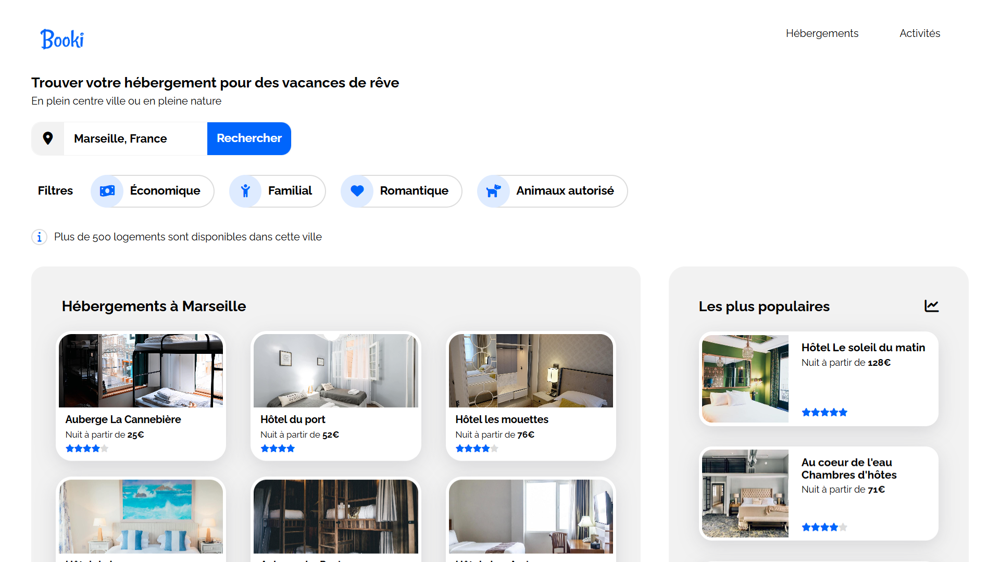

<div align="center">  
    <a href="https://booki-agency-vm.netlify.app/" target="_blank">  
        
    </a>
    </br>  
    </br>  
  <h3 align="center">🏠 Booki - Projet Scolaire</h3>  
</div>

## <br /> 📌 Sommaire

&nbsp;&nbsp;&nbsp; 🎨 &nbsp; [**Introduction**](#introduction)<br />
&nbsp;&nbsp;&nbsp; 🛠️ &nbsp; [**Technologies**](#️technologies)<br />
&nbsp;&nbsp;&nbsp; 🚀 &nbsp; [**Installation**](#installation)<br />

## <br /> <a name="introduction">🎨 Introduction</a>

Page d'accueil pour une agence de réservation d'hôtels, inspirée du design de Booking.

Ce projet adopte une esthétique moderne et minimaliste, développée exclusivement en HTML et CSS. La mise en page suit une approche desktop-first, en s'appuyant uniquement sur Flexbox. Aucun framework CSS n'est autorisé.

Pour plus d'informations, consultez le [dossier](/docs/).

## <br /> <a name="technologies">🛠️ Technologies</a>

### ✅ **Autorisé :**

- HTML
- CSS (Flexbox, Media Queries)
- CDN
- Google Fonts

### ❌ **Interdit :**

- JavaScript
- Frameworks CSS (Bootstrap, Tailwind)
- CSS (Grid, REM, EM)
- Sass

## <br /> <a name="installation">🚀 Installation</a>

### ✅ Pré-requis

🛠️ [**Git**](https://git-scm.com/) &nbsp;&nbsp;

### 📥 Cloner le projet

```bash
git clone git@github.com:ValentinMadiot/booki-agency_ui.git
```

### ▶️ Lancer le projet

Utilisez Live Server pour un rechargement en temps réel.
