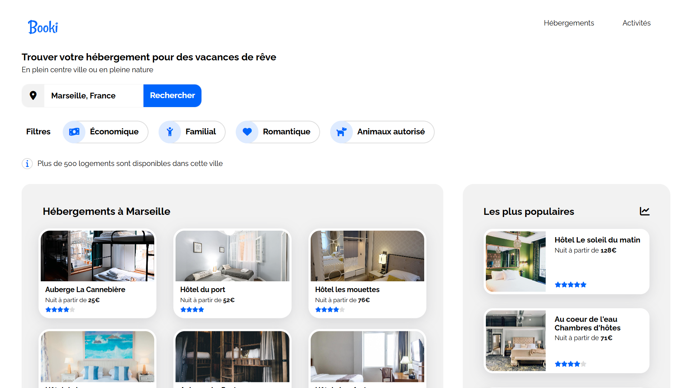

<div align="center">  
    <a href="https://booki-agency-vm.netlify.app/" target="_blank">  
        
    </a>
    </br>  
    </br>  
  <h3 align="center">🏠 Booki - Projet Scolaire</h3>  
</div>

## <br /> 📌 Sommaire

&nbsp;&nbsp;&nbsp; 🎨 &nbsp; [**Introduction**](#introduction)<br />
&nbsp;&nbsp;&nbsp; 🛠️ &nbsp; [**Technologies**](#technologies)<br />
&nbsp;&nbsp;&nbsp; 🚀 &nbsp; [**Installation**](#installation)<br />

## <br /> <a name="introduction">🎨 Introduction</a>

Page d’accueil d’une agence de réservation d’hébergements et d’activités, développée dans le cadre d’un projet scolaire.

Design inspiré de Booking.com avec une approche **desktop-first**, sans JavaScript ni frameworks.

La mise en page repose exclusivement sur **HTML5**, **CSS3**, et **Flexbox**, assurant une structure propre et responsive.

> 📁 Pour plus de détails, consulte le [dossier](/.docs).

## <br /> <a name="technologies">🛠️ Technologies</a>

### ✅ **Autorisé :**

- HTML5 sémantique
- CSS3 (Flexbox, Media Queries)
- CDN externes
- Google Fonts

### ❌ **Interdit :**

- JavaScript
- CSS Grid, unités REM/EM
- Préprocesseurs (Sass, Less)
- Frameworks CSS (Bootstrap, Tailwind, etc.)

## <br /> <a name="installation">🚀 Installation</a>

### ✅ Prérequis

- [Google Chrome](https://www.google.com/) &nbsp;—&nbsp; Navigateur moderne
- [Visual Studio Code](https://code.visualstudio.com/) &nbsp;—&nbsp; Éditeur de code
- [Live Server](https://marketplace.visualstudio.com/items?itemName=ritwickdey.LiveServer) &nbsp;—&nbsp; Extension VS Code

### 📥 Cloner le projet

```bash
git clone git@github.com:ValentinMadiot/booki-agency_ui
cd booki-agency_ui
```

### ▶️ Lancer le projet

Il suffit d’ouvrir le fichier `index.html` dans un navigateur, ou d’utiliser l’extension **Live Server** sur VS Code pour un aperçu dynamique.
